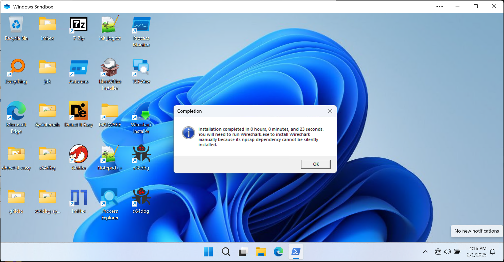

# Windows Sandbox Init Script

This project aims to automatically configure a Windows Sanbox for malware analysis with offline software packages in current working directory.

Please read the script and modify it before using.

