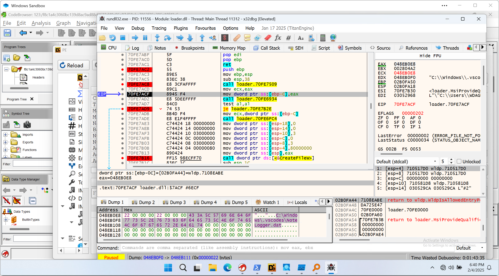

# Windows Sandbox Init Script

## What it does

This project aims to automatically configure a Windows Sanbox for malware analysis with offline software packages in current working directory.

## How to use

Make sure you have Windows Sandbox enabled.

1. Run `download_pkgs.ps1` to download all packages for offline use, and update the checksums for later verification.
2. Start `0-malware-analysis.wsb`.
3. Generally it should be done within a minute.

## Screenshots

https://github.com/user-attachments/assets/f9ba4652-7dab-4d32-a855-526733dbb473

